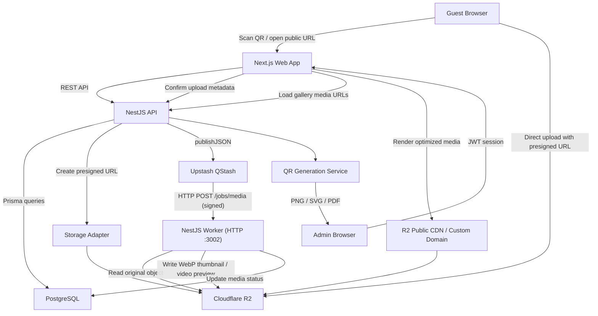
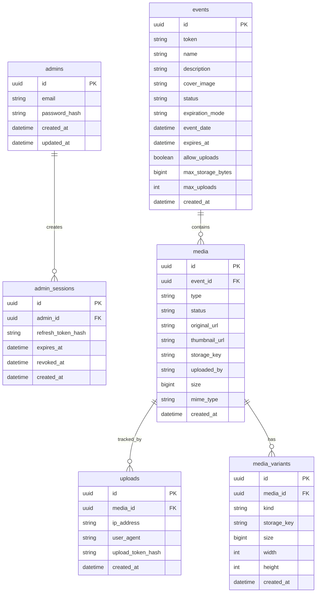
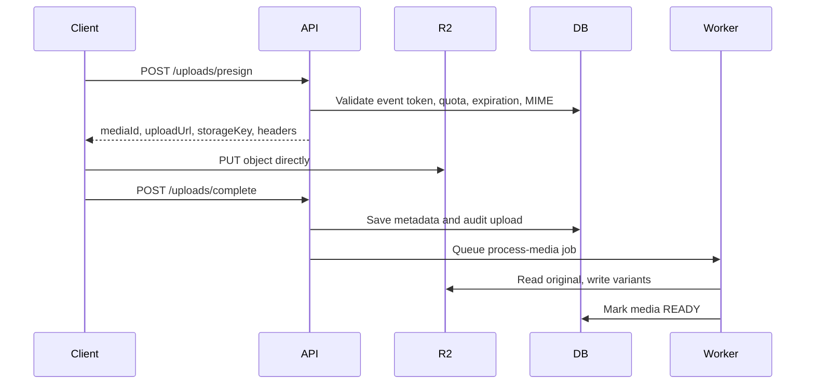

# EventShare Architecture

EventShare is a production-ready SaaS platform for collecting event photos and videos through QR codes. Guests access a public event page without accounts, while administrators manage events, uploads, QR assets, expiration rules, quotas, and analytics from a protected admin panel.

This document defines the target architecture, database model, APIs, storage flow, processing workers, deployment setup, roadmap, and scaling strategy.

## 1. System Architecture Diagram



### Core Principles

- Guests are accountless and identified only by event token, rate limit state, IP metadata, and optional display name.
- Admin operations require JWT authentication.
- Large files never pass through the backend server.
- The API owns validation, authorization, metadata, quotas, and presigned URL issuance.
- Cloud storage owns binary objects.
- Background workers own thumbnails, WebP conversion, EXIF stripping, compression, and video previews.
- Storage is accessed through an interface so Cloudflare R2 can be replaced with AWS S3 or Backblaze B2.

## 2. Database Schema

The requested base tables are extended with production fields for quotas, processing state, deletion, indexing, and explicit expiration behavior.

### Entity Overview



### Tables

#### `admins`

Stores platform administrator credentials.

| Column | Type | Notes |
| --- | --- | --- |
| `id` | UUID | Primary key |
| `email` | varchar unique | Lowercased |
| `password_hash` | varchar | Argon2id hash |
| `created_at` | timestamptz | Audit |
| `updated_at` | timestamptz | Audit |

#### `events`

Stores event configuration and public access token.

| Column | Type | Notes |
| --- | --- | --- |
| `id` | UUID | Internal identifier |
| `token` | varchar unique | Public unguessable token, 128-bit random or stronger |
| `name` | varchar | Event title |
| `description` | text nullable | Public description |
| `cover_image` | varchar nullable | R2 key or public URL |
| `status` | enum | `DRAFT`, `ACTIVE`, `PAUSED`, `EXPIRED`, `ARCHIVED`, `DELETED` |
| `expiration_mode` | enum | `VIEW_ONLY`, `CLOSED`, `ARCHIVE` |
| `event_date` | timestamptz nullable | Event date |
| `expires_at` | timestamptz | Expiration timestamp |
| `allow_uploads` | boolean | Admin override |
| `max_storage_bytes` | bigint nullable | Per-event storage quota |
| `max_uploads` | int nullable | Per-event media quota |
| `created_at` | timestamptz | Audit |
| `updated_at` | timestamptz | Audit |
| `deleted_at` | timestamptz nullable | Soft delete |

#### `media`

Stores original upload metadata and processing state.

| Column | Type | Notes |
| --- | --- | --- |
| `id` | UUID | Primary key |
| `event_id` | UUID FK | Event owner |
| `type` | enum | `IMAGE`, `VIDEO` |
| `status` | enum | `PENDING_UPLOAD`, `UPLOADED`, `PROCESSING`, `READY`, `FAILED`, `DELETED` |
| `original_url` | text nullable | Public or signed delivery URL |
| `thumbnail_url` | text nullable | Gallery thumbnail |
| `storage_key` | varchar unique | Original object key in R2 |
| `thumbnail_key` | varchar nullable | Thumbnail object key |
| `preview_key` | varchar nullable | Video preview object key |
| `uploaded_by` | varchar nullable | Optional guest display name |
| `size` | bigint | Original file size |
| `mime_type` | varchar | Validated MIME |
| `width` | int nullable | Image/video width |
| `height` | int nullable | Image/video height |
| `duration_seconds` | int nullable | Video duration |
| `checksum_sha256` | varchar nullable | Optional integrity check |
| `created_at` | timestamptz | Sort cursor |
| `updated_at` | timestamptz | Audit |
| `deleted_at` | timestamptz nullable | Soft delete |

#### `uploads`

Stores upload audit data without requiring guest accounts.

| Column | Type | Notes |
| --- | --- | --- |
| `id` | UUID | Primary key |
| `media_id` | UUID FK | Media item |
| `ip_address` | inet or varchar | Abuse investigation |
| `user_agent` | text | Device/browser info |
| `upload_token_hash` | varchar nullable | Hash of short-lived upload session token |
| `created_at` | timestamptz | Audit |

### Recommended Indexes

- `events(token)` unique
- `events(status, expires_at)`
- `media(event_id, created_at desc, id desc)` for cursor pagination
- `media(event_id, type, created_at desc)`
- `media(event_id, status)`
- `media(storage_key)` unique
- `uploads(ip_address, created_at)` for abuse detection

## 3. API Endpoints

All endpoints are versioned under `/api/v1`.

### Authentication

| Method | Endpoint | Auth | Purpose |
| --- | --- | --- | --- |
| `POST` | `/auth/login` | Public | Admin login with email/password |
| `POST` | `/auth/refresh` | Refresh token | Rotate access token |
| `POST` | `/auth/logout` | Admin | Revoke refresh token |
| `GET` | `/auth/me` | Admin | Current admin profile |

### Admin Events

| Method | Endpoint | Auth | Purpose |
| --- | --- | --- | --- |
| `GET` | `/admin/events` | Admin | Paginated event search |
| `POST` | `/admin/events` | Admin | Create event, token, public URL, QR metadata |
| `GET` | `/admin/events/:id` | Admin | Event detail and stats |
| `PATCH` | `/admin/events/:id` | Admin | Edit title, description, cover, date, expiration |
| `DELETE` | `/admin/events/:id` | Admin | Soft delete event |
| `POST` | `/admin/events/:id/extend` | Admin | Extend expiration |
| `POST` | `/admin/events/:id/disable-uploads` | Admin | Disable uploads |
| `POST` | `/admin/events/:id/enable-uploads` | Admin | Enable uploads |
| `GET` | `/admin/events/:id/qr.png` | Admin | Download QR PNG |
| `GET` | `/admin/events/:id/qr.svg` | Admin | Download QR SVG |
| `GET` | `/admin/events/:id/qr.pdf` | Admin | Download printable PDF |

### Admin Media

| Method | Endpoint | Auth | Purpose |
| --- | --- | --- | --- |
| `GET` | `/admin/events/:id/media` | Admin | Paginated media list |
| `DELETE` | `/admin/media/:mediaId` | Admin | Soft delete media and optionally storage object |
| `POST` | `/admin/media/:mediaId/reprocess` | Admin | Retry processing |
| `GET` | `/admin/stats` | Admin | Dashboard counts and storage usage |

### Public Event

| Method | Endpoint | Auth | Purpose |
| --- | --- | --- | --- |
| `GET` | `/events/by-token/:token` | Public | Public event metadata and current rules |
| `GET` | `/events/by-token/:token/media` | Public | Gallery cursor pagination |
| `POST` | `/events/by-token/:token/uploads/presign` | Public + rate limit | Create presigned upload URL |
| `POST` | `/events/by-token/:token/uploads/complete` | Public + upload token | Persist metadata after direct upload |
| `GET` | `/media/:mediaId/download` | Public if event viewable | Generate download URL or redirect |

### Public Upload Flow



## 4. Folder Structure

Recommended monorepo layout:

```text
eventshare/
  apps/
    web/
      app/
        (admin)/
          admin/
            page.tsx
            events/
              page.tsx
              new/page.tsx
              [eventId]/page.tsx
        e/
          [token]/
            page.tsx
            loading.tsx
            expired/page.tsx
        login/page.tsx
      components/
        admin/
        gallery/
        upload/
        qr/
        ui/
      lib/
        api-client.ts
        auth.ts
        upload.ts
      next.config.ts
      package.json
    api/
      src/
        main.ts
        app.module.ts
        modules/
          auth/
          admins/
          events/
          media/
          uploads/
          storage/
          qr/
          rate-limit/
          health/
        common/
          decorators/
          filters/
          guards/
          pipes/
          interceptors/
        config/
          app.config.ts
          storage.config.ts
          queue.config.ts
      package.json
    worker/
      src/
        main.ts
        processors/
          media.processor.ts
          image.processor.ts
          video.processor.ts
        services/
          image.service.ts
          video.service.ts
      package.json
  packages/
    shared/
      src/
        dto/
        enums/
        schemas/
        types/
    eslint-config/
    tsconfig/
  prisma/
    schema.prisma
    migrations/
    seed.ts
  infra/
    docker/
      Dockerfile.web
      Dockerfile.api
      Dockerfile.worker
    nginx/
    coolify/
  docs/
    eventshare-architecture.md
  docker-compose.yml
  pnpm-workspace.yaml
  turbo.json
  package.json
```

## 5. Prisma Schema

```prisma
generator client {
  provider = "prisma-client-js"
}

datasource db {
  provider = "postgresql"
  url      = env("DATABASE_URL")
}

enum EventStatus {
  DRAFT
  ACTIVE
  PAUSED
  EXPIRED
  ARCHIVED
  DELETED
}

enum ExpirationMode {
  VIEW_ONLY
  CLOSED
  ARCHIVE
}

enum MediaType {
  IMAGE
  VIDEO
}

enum MediaStatus {
  PENDING_UPLOAD
  UPLOADED
  PROCESSING
  READY
  FAILED
  DELETED
}

enum MediaVariantKind {
  ORIGINAL
  THUMBNAIL
  WEBP
  VIDEO_PREVIEW
}

model Admin {
  id           String   @id @default(uuid()) @db.Uuid
  email        String   @unique
  passwordHash String   @map("password_hash")
  createdAt    DateTime @default(now()) @map("created_at")
  updatedAt    DateTime @updatedAt @map("updated_at")

  sessions AdminSession[]

  @@map("admins")
}

model AdminSession {
  id               String   @id @default(uuid()) @db.Uuid
  adminId          String   @map("admin_id") @db.Uuid
  refreshTokenHash String   @map("refresh_token_hash")
  expiresAt        DateTime @map("expires_at")
  revokedAt        DateTime? @map("revoked_at")
  createdAt        DateTime @default(now()) @map("created_at")

  admin Admin @relation(fields: [adminId], references: [id], onDelete: Cascade)

  @@index([adminId])
  @@map("admin_sessions")
}

model Event {
  id              String         @id @default(uuid()) @db.Uuid
  name            String
  description     String?
  coverImage      String?        @map("cover_image")
  token           String         @unique
  status          EventStatus    @default(DRAFT)
  expirationMode  ExpirationMode @default(VIEW_ONLY) @map("expiration_mode")
  eventDate       DateTime?      @map("event_date")
  expiresAt       DateTime       @map("expires_at")
  allowUploads    Boolean        @default(true) @map("allow_uploads")
  maxStorageBytes BigInt?        @map("max_storage_bytes")
  maxUploads      Int?           @map("max_uploads")
  createdAt       DateTime       @default(now()) @map("created_at")
  updatedAt       DateTime       @updatedAt @map("updated_at")
  deletedAt       DateTime?      @map("deleted_at")

  media Media[]

  @@index([status, expiresAt])
  @@map("events")
}

model Media {
  id              String      @id @default(uuid()) @db.Uuid
  eventId         String      @map("event_id") @db.Uuid
  type            MediaType
  status          MediaStatus @default(PENDING_UPLOAD)
  originalUrl     String?     @map("original_url")
  thumbnailUrl    String?     @map("thumbnail_url")
  storageKey      String      @unique @map("storage_key")
  thumbnailKey    String?     @map("thumbnail_key")
  previewKey      String?     @map("preview_key")
  uploadedBy      String?     @map("uploaded_by")
  size            BigInt
  mimeType        String      @map("mime_type")
  width           Int?
  height          Int?
  durationSeconds Int?        @map("duration_seconds")
  checksumSha256  String?     @map("checksum_sha256")
  createdAt       DateTime    @default(now()) @map("created_at")
  updatedAt       DateTime    @updatedAt @map("updated_at")
  deletedAt       DateTime?   @map("deleted_at")

  event    Event          @relation(fields: [eventId], references: [id], onDelete: Cascade)
  uploads  Upload[]
  variants MediaVariant[]

  @@index([eventId, createdAt, id])
  @@index([eventId, type, createdAt])
  @@index([eventId, status])
  @@map("media")
}

model Upload {
  id              String   @id @default(uuid()) @db.Uuid
  mediaId         String   @map("media_id") @db.Uuid
  ipAddress       String   @map("ip_address")
  userAgent       String?  @map("user_agent")
  uploadTokenHash String?  @map("upload_token_hash")
  createdAt       DateTime @default(now()) @map("created_at")

  media Media @relation(fields: [mediaId], references: [id], onDelete: Cascade)

  @@index([ipAddress, createdAt])
  @@map("uploads")
}

model MediaVariant {
  id         String           @id @default(uuid()) @db.Uuid
  mediaId    String           @map("media_id") @db.Uuid
  kind       MediaVariantKind
  storageKey String           @map("storage_key")
  size       BigInt
  width      Int?
  height     Int?
  createdAt  DateTime         @default(now()) @map("created_at")

  media Media @relation(fields: [mediaId], references: [id], onDelete: Cascade)

  @@unique([mediaId, kind])
  @@map("media_variants")
}
```

## 6. NestJS Modules

### Module Map

| Module | Responsibility |
| --- | --- |
| `AuthModule` | Admin login, JWT access tokens, refresh sessions, password hashing |
| `AdminsModule` | Admin account management and seed bootstrap |
| `EventsModule` | Event CRUD, expiration rules, public token lookup |
| `MediaModule` | Gallery queries, media deletion, metadata updates |
| `UploadsModule` | Presign requests, completion callbacks, upload audit |
| `StorageModule` | Provider abstraction for R2/S3/B2 |
| `QrModule` | QR PNG, SVG, PDF generation |
| `QstashModule` | QStash publish client for media jobs |
| `RateLimitModule` | IP, event, and endpoint-specific limits |
| `HealthModule` | Readiness/liveness checks for DB and storage |

### Clean Architecture Boundaries

- Controllers expose HTTP contracts only.
- Use cases enforce business rules: expiration, quotas, MIME allowlist, upload permissions.
- Repositories hide Prisma.
- Storage providers implement a common `StorageProvider` interface.
- The API only publishes jobs to QStash; workers own processing.

Example storage contract:

```ts
export interface StorageProvider {
  createPresignedPutUrl(input: PresignPutInput): Promise<PresignPutResult>;
  createPresignedGetUrl(input: PresignGetInput): Promise<string>;
  deleteObject(key: string): Promise<void>;
  getPublicUrl(key: string): string;
}
```

## 7. Next.js Pages

Use Next.js App Router with server components for initial data and client components for uploads, lightbox, and gallery interactions.

### Admin Pages

| Route | Purpose |
| --- | --- |
| `/login` | Admin login |
| `/admin` | Dashboard stats: events, photos, videos, storage usage |
| `/admin/events` | Searchable paginated event list |
| `/admin/events/new` | Create event form |
| `/admin/events/[eventId]` | Event detail, QR download, media moderation |
| `/admin/events/[eventId]/edit` | Edit title, description, cover, date, expiration |

### Public Guest Pages

| Route | Purpose |
| --- | --- |
| `/e/[token]` | Public event landing page, upload, gallery |
| `/e/[token]/expired` | Expired state when mode closes event |
| `/e/[token]/media/[mediaId]` | Optional shareable media detail |

### Guest UI Features

- Pinterest-style masonry gallery using CSS columns or virtualized masonry.
- Infinite scroll with cursor pagination.
- Lazy image loading using `next/image` where possible or direct CDN URLs.
- Progressive image loading from thumbnail to full media.
- Lightbox with fullscreen support.
- Download and Web Share API buttons.
- Sort by newest or oldest.
- Search by display name or filename-derived metadata if retained.
- Upload multiple files and camera capture through `accept` and `capture` inputs.

## 8. Cloudflare R2 Integration

Cloudflare R2 is S3-compatible, so the implementation should use AWS SDK v3 with a custom endpoint.

Required environment variables:

```env
STORAGE_PROVIDER=r2
R2_ACCOUNT_ID=
R2_ACCESS_KEY_ID=
R2_SECRET_ACCESS_KEY=
R2_BUCKET=
R2_PUBLIC_BASE_URL=https://media.eventshare.app
R2_ENDPOINT=https://<account-id>.r2.cloudflarestorage.com
```

Minimal R2 provider implementation shape:

```ts
import { PutObjectCommand, S3Client } from "@aws-sdk/client-s3";
import { getSignedUrl } from "@aws-sdk/s3-request-presigner";

export class R2StorageProvider implements StorageProvider {
  constructor(
    private readonly client: S3Client,
    private readonly bucket: string,
    private readonly publicBaseUrl: string,
  ) {}

  async createPresignedPutUrl(input: PresignPutInput): Promise<PresignPutResult> {
    const command = new PutObjectCommand({
      Bucket: this.bucket,
      Key: input.key,
      ContentType: input.mimeType,
      ContentLength: input.size,
    });

    return {
      url: await getSignedUrl(this.client, command, { expiresIn: input.ttlSeconds }),
      headers: { "Content-Type": input.mimeType },
    };
  }

  getPublicUrl(key: string): string {
    return `${this.publicBaseUrl}/${key}`;
  }
}
```

Recommended object key format:

```text
events/{eventId}/original/{mediaId}/{safeFilename}
events/{eventId}/variants/{mediaId}/thumbnail.webp
events/{eventId}/variants/{mediaId}/preview.jpg
events/{eventId}/variants/{mediaId}/optimized.webp
```

Presigned PUT constraints:

- Short TTL, usually 5 to 10 minutes.
- Server-generated object key only.
- Enforce expected content type.
- Enforce maximum file size before presign and during complete callback.
- Store media as `PENDING_UPLOAD` before issuing URL.
- Mark as `UPLOADED` only after completion callback.

## 9. Presigned Upload Implementation

### Request

```http
POST /api/v1/events/by-token/{token}/uploads/presign
Content-Type: application/json

{
  "filename": "photo.jpg",
  "mimeType": "image/jpeg",
  "size": 8421931,
  "uploadedBy": "John"
}
```

### Response

```json
{
  "mediaId": "6eec15fa-fbd4-42d6-85c2-10f16b1f6b52",
  "uploadUrl": "https://...",
  "method": "PUT",
  "storageKey": "events/.../original/...",
  "expiresInSeconds": 600,
  "headers": {
    "Content-Type": "image/jpeg"
  },
  "completeUrl": "/api/v1/events/by-token/abc/uploads/complete",
  "uploadToken": "short-lived-signed-token"
}
```

### Completion

```http
POST /api/v1/events/by-token/{token}/uploads/complete
Content-Type: application/json

{
  "mediaId": "6eec15fa-fbd4-42d6-85c2-10f16b1f6b52",
  "uploadToken": "short-lived-signed-token",
  "checksumSha256": "optional-client-checksum"
}
```

### Validation Rules

- Allowed image formats: `jpg`, `jpeg`, `png`, `webp`, `heic`.
- Allowed video formats: `mp4`, `mov`, `hevc`.
- Max video size: 500 MB.
- Image limit should be configurable, for example 50 MB.
- Reject uploads when event is expired and mode disallows uploads.
- Reject uploads when `allow_uploads=false`.
- Reject uploads when per-event quota is exceeded.
- Rate limit by IP, event token, and upload count.
- Queue virus scanning hook before marking media as public if required by deployment policy.

## 10. QR Generation Service

The QR service generates the public event URL:

```text
https://eventshare.app/e/{token}
```

Output formats:

- PNG for quick download and social sharing.
- SVG for print quality.
- PDF for physical handouts with title, date, instructions, and QR code.

Recommended libraries:

- `qrcode` for PNG/SVG generation.
- `pdf-lib` or `pdfkit` for printable PDF.

Service behavior:

- QR codes are generated on demand from current event token.
- PDF can include event name, expiration date, and short instructions.
- Admin-only endpoint prevents public enumeration of event QR assets.
- Regenerating an event token invalidates old QR URLs.

## 11. Background Worker Implementation

Use **Upstash QStash** (HTTP-based queue). The API publishes a job with `publishJSON`, and QStash delivers a signed HTTP `POST /jobs/media` to `apps/worker`. The worker verifies the `Upstash-Signature` header, processes the media, and returns `2xx`. On non-2xx, QStash retries automatically (`retries: 3`).

### Jobs

| Endpoint | Job (`jobName`) | Purpose |
| --- | --- | --- |
| `POST /jobs/media` | `process-image` | Strip EXIF, compress, generate WebP and thumbnail |
| `POST /jobs/media` | `process-video` | Validate container, generate preview image |

Idempotency: QStash may redeliver, so the worker skips media already in `READY` status.

### Image Pipeline

1. Download original object from R2.
2. Verify MIME and decode image.
3. Strip EXIF metadata.
4. Generate `thumbnail.webp`, for example 480px wide.
5. Generate optimized WebP variant, for example 1920px max width.
6. Upload variants to R2.
7. Update `media.status=READY`, dimensions, URLs, and variants.

Recommended library: `sharp`.

### Video Pipeline

1. Validate extension and MIME.
2. Probe metadata with `ffprobe`.
3. Generate preview frame with `ffmpeg`.
4. Optionally transcode only in premium/background tier, because video transcoding is expensive.
5. Update duration, dimensions, preview URL, and status.

### Failure Handling

- QStash retries failed deliveries (non-2xx) automatically with backoff.
- Mark permanent decode/validation failures as `FAILED`.
- Keep original object private until processing and validation are complete when strict moderation is required.
- Expose failed uploads in admin panel for deletion or retry.

## 12. Docker Setup

Local development should run PostgreSQL, API, worker, and web through Docker Compose. The QStash dev server (`pnpm qstash:dev`) runs separately on the host.

```yaml
services:
  postgres:
    image: postgres:16-alpine
    environment:
      POSTGRES_DB: eventshare
      POSTGRES_USER: eventshare
      POSTGRES_PASSWORD: eventshare
    ports:
      - "5432:5432"
    volumes:
      - postgres-data:/var/lib/postgresql/data

  api:
    build:
      context: .
      dockerfile: infra/docker/Dockerfile.api
    env_file: .env
    depends_on:
      - postgres
    ports:
      - "3001:3001"

  worker:
    build:
      context: .
      dockerfile: infra/docker/Dockerfile.worker
    env_file: .env
    depends_on:
      - postgres
    ports:
      - "3002:3002"

  web:
    build:
      context: .
      dockerfile: infra/docker/Dockerfile.web
    env_file: .env
    depends_on:
      - api
    ports:
      - "3000:3000"

volumes:
  postgres-data:
```

Container notes:

- API and worker use the same Prisma client and environment.
- Web uses `NEXT_PUBLIC_API_BASE_URL`.
- In production, the database can be a managed service or Coolify service; QStash is a hosted Upstash service.
- The worker must be publicly reachable over HTTPS so QStash can POST jobs to it.
- Worker should be scaled independently from API.

## 13. Deployment Guide

### Environment Setup

Required production variables:

```env
DATABASE_URL=
QSTASH_TOKEN=
QSTASH_CURRENT_SIGNING_KEY=
QSTASH_NEXT_SIGNING_KEY=
WORKER_PUBLIC_URL=https://worker.eventshare.app
JWT_ACCESS_SECRET=
JWT_REFRESH_SECRET=
APP_PUBLIC_URL=https://eventshare.app
API_PUBLIC_URL=https://api.eventshare.app
NEXT_PUBLIC_API_BASE_URL=https://api.eventshare.app/api/v1
STORAGE_PROVIDER=r2
R2_ACCOUNT_ID=
R2_ACCESS_KEY_ID=
R2_SECRET_ACCESS_KEY=
R2_BUCKET=
R2_PUBLIC_BASE_URL=https://media.eventshare.app
MAX_IMAGE_SIZE_MB=50
MAX_VIDEO_SIZE_MB=500
DEFAULT_EVENT_STORAGE_QUOTA_GB=20
```

### Coolify Deployment

1. Create a PostgreSQL service and an Upstash QStash project (token + signing keys).
2. Create Cloudflare R2 bucket and public custom domain.
3. Add secrets to Coolify project environment.
4. Deploy `api`, `worker`, and `web` as separate services.
5. Run Prisma migrations as a release command:

```bash
pnpm prisma migrate deploy
```

6. Seed first admin with a one-time command:

```bash
pnpm --filter api seed:admin
```

7. Configure custom domains:

- `eventshare.app` -> Next.js web
- `api.eventshare.app` -> NestJS API
- `media.eventshare.app` -> R2 public bucket or CDN

### GitHub Actions

Pipeline stages:

1. Install dependencies with frozen lockfile.
2. Run lint and type checks.
3. Run unit tests.
4. Run Prisma schema validation.
5. Build web, API, and worker images.
6. Push images to registry.
7. Trigger Coolify deployment webhook.

## 14. MVP Roadmap

### Phase 1: Secure Core

- Monorepo setup with Next.js, NestJS, Prisma, PostgreSQL, QStash.
- Admin login with JWT.
- Event CRUD with secure tokens and expiration modes.
- Public event page by token.
- R2 presigned upload flow.
- Basic gallery with pagination.
- QR PNG/SVG/PDF generation.

### Phase 2: Media Processing

- QStash HTTP worker.
- Image thumbnails, WebP conversion, EXIF stripping.
- Video preview image generation.
- Upload status states and retry handling.
- Admin media moderation.

### Phase 3: Production Admin

- Dashboard statistics.
- Search and pagination for events/uploads.
- Storage usage reporting.
- Per-event quotas and upload limits.
- Disable uploads and extend expiration.
- Audit logs for admin actions.

### Phase 4: Guest Experience

- Pinterest masonry gallery.
- Infinite scroll and progressive loading.
- Lightbox fullscreen mode.
- Download and share actions.
- Optional display names.
- Mobile camera upload improvements.

### Phase 5: Commercial Features

- Premium plans.
- Custom domains.
- White-label branding.
- Live slideshow.
- Reactions and comments.
- AI best-photo selection.
- Face recognition albums, only with explicit privacy policy and opt-in.

## 15. Scaling Strategy for 100,000+ Uploaded Photos

### Storage and Delivery

- Store originals and variants in R2, not on app servers.
- Serve gallery assets from R2 custom domain or CDN.
- Generate small thumbnails for grid view and load originals only in lightbox.
- Use immutable cache headers for variant objects.
- Keep object keys partitioned by event and media ID.

### Upload Throughput

- Direct-to-storage upload removes API bandwidth bottleneck.
- API only handles small JSON requests for presign and completion.
- Rate limit presign endpoints by IP and event token.
- Use short-lived upload tokens to prevent arbitrary completion calls.
- Scale API horizontally behind a load balancer.

### Database Performance

- Cursor pagination by `(created_at, id)` instead of offset pagination.
- Composite indexes on `media(event_id, created_at, id)`.
- Keep aggregate counters on event rows or a stats table for dashboard speed.
- Use soft deletes and asynchronous cleanup for storage objects.
- Partition `uploads` by time if audit volume becomes high.

### Queue and Processing

- Scale worker HTTP instances independently behind a load balancer.
- QStash handles delivery, retries, and backoff; tune `retries` and `Upstash-Timeout` for long video jobs.
- Prioritize thumbnail generation before expensive optimization.
- Use QStash DLQ for repeated failures.

### Quotas and Abuse Control

- Per-event max uploads and max storage bytes.
- Per-IP upload rate limits.
- File signature validation, not only extension checks.
- Optional virus scan before media becomes public.
- Admin delete and event pause controls.

### Observability

- Track API latency, presign failures, upload completion rate, QStash delivery/retry counts, job duration, and processing failures.
- Log storage keys, media IDs, event IDs, and request IDs.
- Add alerts for QStash delivery failures, DB connection saturation, and R2 error rate.
- Use structured logs and OpenTelemetry-compatible tracing.

### Event Expiration at Scale

- Store `expires_at` and `expiration_mode` in DB.
- Scheduled worker marks expired events in batches.
- API also evaluates expiration at request time to avoid stale state.
- Modes:
  - `VIEW_ONLY`: gallery remains viewable, uploads disabled.
  - `CLOSED`: public event returns "This event has expired."
  - `ARCHIVE`: gallery can move to cheaper storage or require admin-only access.

## Security Checklist

- Token generation uses at least 128 bits of cryptographic randomness.
- Admin passwords use Argon2id.
- Refresh tokens are stored hashed and rotated.
- CORS only allows configured web origins.
- Presigned URLs are short-lived.
- File type is validated by MIME, extension, and magic bytes.
- Guest upload endpoints have IP and event-level rate limits.
- Event quotas are enforced before presign and after completion.
- Public gallery never exposes admin-only metadata.
- Deleted media is hidden immediately, with storage cleanup async.
- Security headers are configured in Next.js and API gateway.

## Production Defaults

| Setting | Recommended Default |
| --- | --- |
| Event token length | 32 random bytes, base64url encoded |
| Presigned upload TTL | 10 minutes |
| Image max size | 50 MB |
| Video max size | 500 MB |
| Thumbnail width | 480 px |
| Optimized image max width | 1920 px |
| Gallery page size | 30 to 60 items |
| Upload completion timeout | 15 minutes |
| Pending upload cleanup | Every 30 minutes |

## Summary

EventShare should be built as a monorepo with a Next.js web app, NestJS API, NestJS HTTP worker driven by Upstash QStash, PostgreSQL database, and Cloudflare R2 storage. The architecture avoids backend file proxying, keeps guest access simple, gives admins operational control, and scales media-heavy event galleries through direct uploads, async processing, cursor pagination, CDN delivery, and independent worker scaling.
